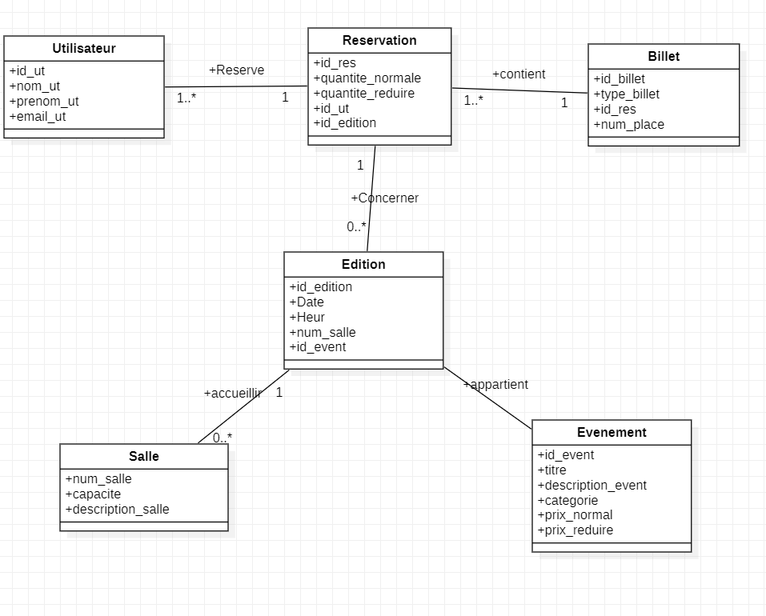
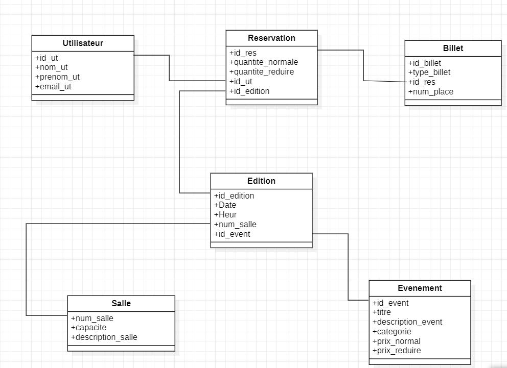

[](https://classroom.github.com/a/0ijgaV38)
# Conception_Association_Farha

# Projet Base de Données : Gestion des événements

Ce projet consiste à créer une base de données pour la gestion d'événements. Il inclut les tables suivantes : Utilisateur, Salle, Événement, Édition, Réservation et Billet. Vous trouverez ci-dessous les modèles conceptuels et physiques ainsi que le script SQL pour créer la base de données.

## Images

- **Dictionnaire de données**&#x20;


- **Modèle Conceptuel de Données (MCD)**&#x20;



- **Modèle Logique de Données (MLD)**&#x20;



## Script SQL

```sql
CREATE DATABASE farah;
USE farah;

-- Table: Utilisateur
CREATE TABLE Utilisateur (
    id_ut VARCHAR(50) PRIMARY KEY,
    nom_ut VARCHAR(100) NOT NULL,
    prenom_ut VARCHAR(100) NOT NULL,
    email_ut VARCHAR(100) NOT NULL UNIQUE
);

-- Table: Salle
CREATE TABLE Salle (
    num_salle VARCHAR(50) PRIMARY KEY,
    capacite INT NOT NULL,
    description_salle VARCHAR(255) NOT NULL
);

-- Table: Evenement
CREATE TABLE Evenement (
    id_event VARCHAR(50) PRIMARY KEY,
    titre VARCHAR(100) NOT NULL,
    description_event VARCHAR(255) NOT NULL,
    prix_normal DECIMAL(10, 2) NOT NULL,
    prix_reduire DECIMAL(10, 2) NOT NULL,
    categorie ENUM('Théâtre', 'Cinéma', 'Musique', 'Rencontre') NOT NULL
);

-- Table: Edition
CREATE TABLE Edition (
    id_edition VARCHAR(50) PRIMARY KEY,
    id_event VARCHAR(50) NOT NULL,
    num_salle VARCHAR(50) NOT NULL,
    date DATETIME NOT NULL,
    heure TIME NOT NULL,
    FOREIGN KEY (id_event) REFERENCES Evenement(id_event)
        ON UPDATE CASCADE
        ON DELETE CASCADE,
    FOREIGN KEY (num_salle) REFERENCES Salle(num_salle)
        ON UPDATE CASCADE
        ON DELETE CASCADE
);

-- Table: Reservation
CREATE TABLE Reservation (
    id_res VARCHAR(50) PRIMARY KEY,
    quantite_normale INT NOT NULL,
    quantite_reduire INT NOT NULL,
    id_ut VARCHAR(50) NOT NULL,
    id_edition VARCHAR(50) NOT NULL,
    FOREIGN KEY (id_ut) REFERENCES Utilisateur(id_ut)
        ON UPDATE CASCADE
        ON DELETE CASCADE,
    FOREIGN KEY (id_edition) REFERENCES Edition(id_edition)
        ON UPDATE CASCADE
        ON DELETE CASCADE
);

-- Table: Billet
CREATE TABLE Billet (
    id_billet VARCHAR(50) PRIMARY KEY,
    type_billet ENUM('reduire', 'normale') NOT NULL,
    num_place INT NOT NULL,
    id_res VARCHAR(50) NOT NULL,
    FOREIGN KEY (id_res) REFERENCES Reservation(id_res)
        ON UPDATE CASCADE
        ON DELETE CASCADE
);
```


